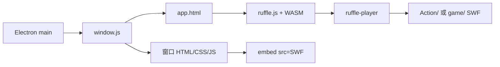

# Electron 桌面端架构

## 执行摘要

`qq-pet-macos/` 是当前可发布的桌宠应用。Electron 主进程负责单实例、窗口、托盘、本地服务和状态初始化；renderer 通过共享 HTML 壳加载 Vue 与 Ruffle，并用传统 `<embed>` 路径驱动宠物动作和小游戏 SWF。

## 技术栈

| 层 | 技术 |
|---|---|
| 桌面运行时 | Electron 28、Node.js、JavaScript |
| UI | Vue 全局构建、HTML/CSS、注入式 renderer 模块 |
| Flash 兼容 | 自托管 Ruffle JavaScript/WASM |
| 持久化 | electron-store 8、明文 `config-macos.json` |
| 本地服务 | Express、WebSocket、Electron IPC |
| 打包 | electron-builder |

## 架构模式

主进程采用初始化编排模式：`main.js` 顺序加载 `src/ini/` 模块，建立全局 Store、宠物状态和窗口管理器。窗口使用统一的 `app.html` 壳，再由 `window.js` 注入具体页面、样式和脚本。运行态以 `global.petInfo` 等对象为中心，通过监听器、IPC 和 Store 写盘向外传播。

## 核心组件

| 组件 | 职责 |
|---|---|
| `main.js` | 应用入口、单实例锁、启动编排 |
| `src/ini/store.js` | electron-store 初始化和配置文件命名 |
| `src/ini/pet.js` | 宠物内存态、更新函数、监听器和持久化 |
| `src/ini/doMain.js` | 恢复 Store、创建主窗口 |
| `src/ini/dataWatcher.js` | 接收 Python 原子写入后的文件变更 |
| `src/windows/window.js` | BrowserWindow 工厂、页面资源注入 |
| `src/windows/util/pet/swfPet.js` | 宠物动作路由和播放状态机 |
| `src/windows/popups/smallGame/` | 小游戏选择和 SWF 切换 |

## Ruffle/Flash 加载

- `app.html` 在 Ruffle 脚本加载前设置 `window.RufflePlayer.config`。
- `window.js` 加载共享壳并注入窗口业务资源。
- Ruffle polyfill 自动接管 `<embed>`，业务层仍使用 Flash 风格的播放接口。
- `swfPet.js` 按性别、年龄、心情、健康和当前活动计算动作路径。
- 切换动作或游戏时克隆 `<embed>`、替换 `src`，再移除旧节点。

## 数据架构

Store 以 `pet`、`cache`、`sys` 等顶层域保存宠物数据、库存与用户设置。`pet.js` 是运行态写入边界；所有属性变更最终写回 `config-macos.json`。外部工具仅应修改已知 schema，并保留未识别字段。

## 接口设计

- **文件接口：** `config-macos.json` 连接 Electron 与 Python CLI。
- **IPC：** renderer 通过 preload 暴露的有限接口请求窗口操作、标题变更或关闭。
- **本地 HTTP：** Express 提供应用静态资源和本地访问地址。
- **WebSocket：** 服务模块支持运行时消息通道。

## 源码结构

详见 [源码树分析](./source-tree-analysis.md)。桌面端关键目录是 `src/ini/`、`src/windows/`、`src/service/` 和 `src/assets/`。

## 开发工作流

使用 Node.js 22，执行 `npm install`、`npm start` 或对应 `npm run build:*`。涉及 SWF 时必须同时验证资源路径、Ruffle runtime 和安装包内容。详见 [桌面端开发指南](./development-guide-desktop-port.md)。

## 部署架构

GitHub Actions 在 macOS、Windows 和 Linux runner 上下载固定资源包，再调用 electron-builder 生成各平台安装包。详见 [构建与发布指南](./deployment-guide.md)。

## 测试策略

当前 Electron 端没有自动化测试。至少手工验证启动、托盘、窗口透明、宠物动作、小程序加载，以及 Python 修改状态后的热同步。
