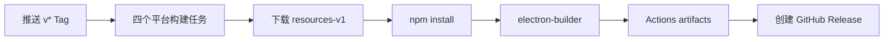

# 构建与发布指南

## 触发方式

`.github/workflows/build.yml` 支持：

- 推送 `v*` Tag：构建并创建 GitHub Release。
- `workflow_dispatch`：只执行构建任务；Release job 仍要求 Tag 引用。

## 构建矩阵

| Runner | 架构 | 产物 |
|---|---|---|
| `macos-latest` | arm64 | DMG、ZIP |
| `windows-latest` | x64 | NSIS Installer、Portable EXE |
| `ubuntu-latest` | x64 | AppImage、tar.gz |
| `ubuntu-24.04-arm` | arm64 | AppImage、tar.gz |

## 流水线



每个构建任务会：

1. Checkout Tag 对应源码。
2. 使用 Node.js 20。
3. 从当前仓库 `resources-v1` Release 下载 `qq-pet-resources.tar.gz`。
4. 在 `qq-pet-macos/` 解压资源并安装 dependencies。
5. 使用 Tag 名覆盖应用版本号。
6. 运行 Electron Builder。
7. 上传临时 artifact。

最终 Release job 合并所有 artifact，并通过 `softprops/action-gh-release` 上传。

## 发布步骤

1. 完成代码和测试。
2. 同步 `qq-pet-macos/package.json` 与 `package-lock.json` 版本。
3. 提交并推送 `main`。
4. 创建并推送 Tag：

```bash
git tag -a v1.6.2 -m "v1.6.2"
git push origin v1.6.2
```

## 资源 Release

`resources-v1` 是构建输入，不是普通版本产物。只要 SWF/Ruffle 大资源没有变化，就不需要重复上传。工作流会复用现有附件。

## 版本和预发布

- Tag `v1.7.0` 创建正式 Release。
- Tag `v1.7.0-beta.1` 因包含 `-` 自动标记为 prerelease。
- GitHub 自动生成源码 ZIP 和 tar.gz；安装包由工作流上传。

## 发布风险

- 应用未进行 Apple notarization 或 Windows code signing。
- Linux AppImage 可能依赖 `libfuse2`。
- 资源 Release 缺失或文件名不匹配会导致所有平台失败。
- Electron Builder 的 macOS 配置当前仅生成 arm64。

