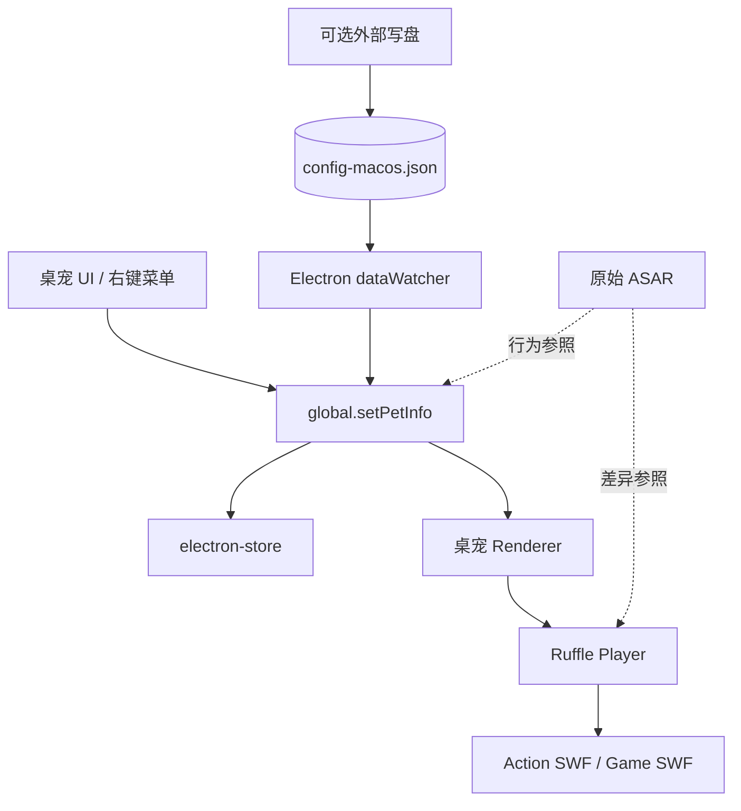
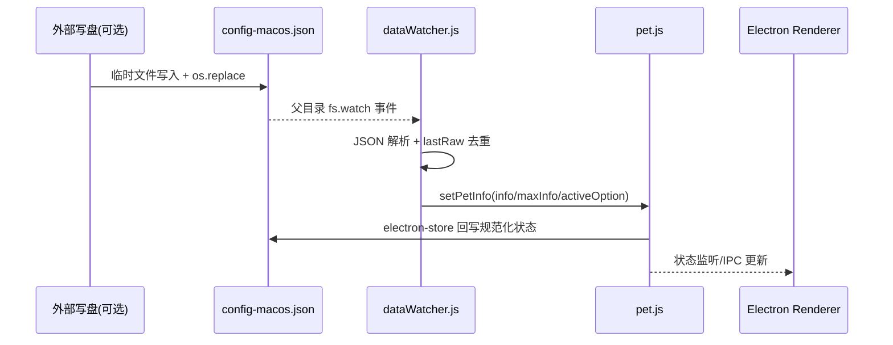
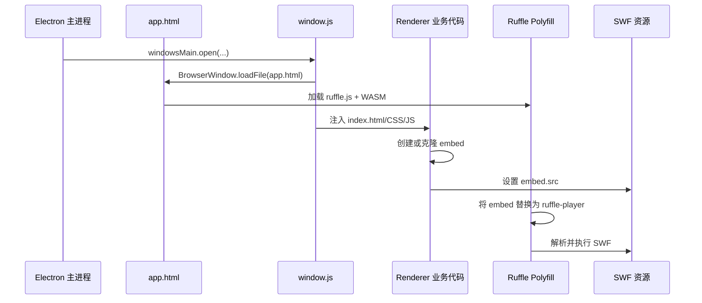

# 集成架构

## 部分关系

## 外部文件 → Electron 状态同步

`dataWatcher` 仍保留：外部工具若原子替换 Store 文件，运行中的桌宠可热同步。Python CLI 已移除，该链路不再作为默认产品路径。

### 为什么监听父目录

外部写入常使用临时文件加 `os.replace`。该操作会替换 inode，直接监听文件会在 macOS 上失效，因此 Electron 监听 `userData` 父目录并按 `config-macos.json` 文件名过滤。

### 防反馈循环

`setPetInfo` 会再次触发 electron-store 写盘。`dataWatcher.js` 使用三层保护：

1. `lastRaw` 忽略内容完全相同的事件。
2. 仅同步 `info`、`maxInfo`、`activeOption`，避开对象引用比较造成的误变更。
3. `setPetInfo` 后重新读取文件，吸收 Electron 自己的回写结果。

## Ruffle/Flash 加载链路

## 共享 Store Schema

主要顶层键：

- `pet.info`：姓名、成长、饥饿、清洁、健康、心情、坐标等。
- `pet.maxInfo`：等级和属性上限。
- `pet.activeOption`：工作、学习、旅行、疾病和死亡状态。
- `pet.activeValue`：学习等活动累计值。
- `cache.store`：食物、日用品、药品和背景库存。
- `sys`：透明度、快捷键、LLM、专注提醒等用户设置。

移植版使用明文 `config-macos.json`；原版 `config.json` 使用 AES-256-CBC。
